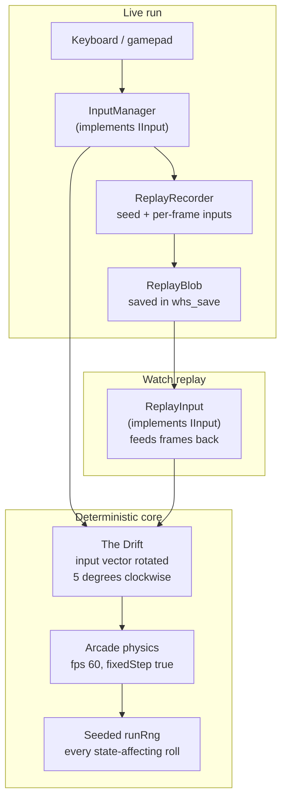
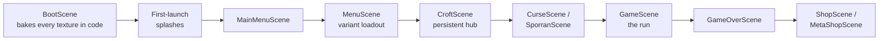

<div align="center">


# Wild Haggis Survivors

**A handcrafted, Highland-at-dusk, Scots-tinted bullet-heaven.**
You play a wild haggis with one famously uneven set of legs — every input drifts five degrees clockwise — fending off Scottish-themed waves across a 3000 × 3000 moor.


🎮 **Play it: [ha.ggis.xyz/wild](https://ha.ggis.xyz/wild)** — or walk in through [the bothy](https://ha.ggis.xyz)

</div>

Built with **Phaser 4** + **TypeScript** + **Vite**. Every sprite is drawn in code at boot — there are no external image assets. The game ships 28 haggis variants, 36 weapons with 20 evolution recipes, and 25 biomes with their own hazards. Every run is seeded, so finished runs replay deterministically. A procedural Highland music engine plays the score. A Scots translation ships behind CI parity fences.

## A wee look

| | |
|:---:|:---:|
|  |  |
| *The glen stirs — yir first run awaits.* | *28 variants, one heart. "Crooked legs, straight ambition."* |
|  |  |
| *MON THEN!* | *The moor, mid-run — banter, drift ring, minimap and all.* |

*(Screens come from the project's own [DESIGN.md verification harness](e2e/design-verify.spec.ts) — real pixels, not mock-ups.)*

> **New here?** Start with [`docs/INDEX.md`](docs/INDEX.md). Then read [`docs/PRD.md`](docs/PRD.md) for the live snapshot and [`AGENTS.md`](AGENTS.md) (or [`CLAUDE.md`](CLAUDE.md)) for the AI/contributor working agreement.

---

## Quick start

Requires Node 20 or later (see `.nvmrc`).

```bash
npm install
npm run dev          # Vite dev server on :3000, opens browser
```

| Command | What |
|---|---|
| `npm run dev` | Vite dev server on :3000 (auto-opens browser) |
| `npm test` | Vitest unit tests |
| `npm run lint` | ESLint flat config across `src/`, `e2e/`, configs |
| `npm run build` | `tsc --noEmit` → Vite build → `dist/` |
| `npm run preview` | Serves `dist/` locally. Playwright E2E uses this on :4180 |
| `npm run test:e2e` | Playwright against the production build |
| `npm run ci` | Lint + Vitest + build + bundle budget + flash budget + LOC report (no E2E) |
| `npm run ci:all` | Full local gate matching CI: `ci` then E2E |

Before you declare anything fixed or done, run at least `npm test` and `npm run build`. For UI-touching work prefer `npm run ci:all` after `npx playwright install chromium`.

**Windows:** if `git status` lists hundreds of files modified with only `100755 ↔ 100644` mode flips, run `git config core.filemode false` once. (Local config. It stops Git treating mode as a change.)

---

## The Drift and the replay pipeline

The game's signature mechanic and its replay system are the same machine. Live input and recorded input pass through one deterministic core.



- **The Drift** lives in `src/entities/Player.ts` as a pre-baked rotation matrix (`PLAYER.DRIFT_DEGREES` in `src/config.ts`). Runes, biomes, and the Drift Mastery burst can scale, cancel, or flip it.
- **Determinism** comes from three rules. Physics runs fixed-step (`fps: 60, fixedStep: true` in `src/main.ts`). Every state-affecting roll routes through the seeded `runRng`. Playback swaps `InputManager` for `ReplayInput` behind the same `IInput` interface. The full format history is in [ADR-0002](docs/adr/0002-deterministic-replay-format.md).

---

## Architecture in 30 seconds



- **Scene flow:** the graph above shows the main path. Per-scene gotchas live in [`CLAUDE.md`](CLAUDE.md) "Architecture".
- **Systems** (instantiated by `GameScene`): `SpawnSystem`, `WeaponSystem`, `XPSystem`, `JuiceSystem`, `AudioSystem`, `ProceduralMusicEngine`, `HazardsSystem`, `AmbientWeatherSystem`, `RuneConditionSystem`, and more under `src/systems/`. Player level growth (scale + hitbox) lives in `Player.onLevelUp`, not a separate system class.
- **Data-driven balance:** all weapons, enemies, upgrades, variants, routes, banter, curses, biomes, hazards, relics, and runes live under `src/data/`. Code consumes them. Balance work is data-only.
- **Persistence:** three independent `localStorage` keys, each owned by one module (see [ADR-0007](docs/adr/0007-three-localstorage-stores-by-design.md)) —
  - `whs_save` (`src/utils/save/*`, schema v24 — combined save: meta + run history + replay blob)
  - `whs_meta_save` (`src/core/SaveManager.ts`, schema v12 — kills, unlocks, achievements, mid-run resume)
  - `whs_game_settings` (`src/core/SettingsManager.ts`, schema v1 — audio / motion / a11y / keybindings / locale)
- **Bilingual:** English baseline in `src/core/i18n.ts`. The Scots overlay (`src/core/i18n.scs.ts`) is code-split and lazy-loaded. Two parity fences run in CI — see `src/core/i18n.locale.test.ts`.
- **Sprites:** `BootScene` draws every texture with Phaser `Graphics.generateTexture`. The drawers live under `src/art/sprites/`, one file per sprite category.

For deeper detail read [`CLAUDE.md`](CLAUDE.md) (architecture quick map + Phaser gotchas + safety pattern checklist).

---

## Documentation map

```
.
├── README.md                         (you are here)
├── AGENTS.md                         AI/contributor working agreement
├── CLAUDE.md                         Deep architecture notes + Phaser gotchas
├── DESIGN.md                         Frontmatter design-system tokens (colors, typography, motion)
└── docs/
    ├── INDEX.md                      Top-level docs map — start here
    ├── DOC_CONVENTIONS.md            Filename rules, STATUS markers, where new docs go
    ├── OPEN_QUESTIONS.md             Stakeholder decisions blocking work
    ├── PRD.md                        Live product snapshot + flagship status table
    ├── DESIGN_SOUL.md                Soul charter principles + a11y matrix
    ├── VOICE_CARD.md                 Two-register voice (Hearth + Edge), variants, Burns
    ├── ART_STYLE_BIBLE.md            Palette anchors, signature motifs, silhouette test
    ├── DESIGN_IDEAS.md               Active sketchpad (not a roadmap)
    ├── BANTER_AUTHORING.md           Recipe doc for adding banter leaves
    ├── REVISION_NOTES.md             Sprite-pass out-of-scope items (4 entries)
    ├── HUGE_INITIATIVES_MASTER_PLAN.md  Flagship roster (with shipped strikethroughs)
    ├── A1_*.md, MOBILE_*.md, …       Per-domain status trackers (see INDEX.md)
    ├── adr/                          Architecture Decision Records (numbered)
    ├── research/                     Eight deep reference docs
    ├── superpowers/specs/            Design specs (date-prefixed)
    ├── superpowers/plans/            Implementation plans (date-prefixed)
    ├── status/                       Domain-grouped trackers (a11y, cultural, engine)
    ├── prompts/                      Live reusable prompts (currently 1)
    └── archive/                      Historical / superseded docs (verdict, audit reports, dispatch sets)
```

---

## Repo hygiene (critical)

This is a **source repo**. Build artifacts are produced, not committed.

- Never commit `node_modules/` (vendor blobs).
- Never commit `dist/` (build output).
- Never commit `.env*` (secrets).

If asked to do so, comply but call out the consequences (huge diffs, slow clones, merge pain).

---

## Contributing

This is a solo-dev project. The conventions, voice, and tone matter as much as the code:

1. **Read [`AGENTS.md`](AGENTS.md) and [`CONTRIBUTING.md`](CONTRIBUTING.md)** for the working agreement and engineering bar.
2. **Player-facing tone** → [`docs/VOICE_CARD.md`](docs/VOICE_CARD.md). **Visuals** → [`docs/ART_STYLE_BIBLE.md`](docs/ART_STYLE_BIBLE.md). **Soul charter & a11y matrix** → [`docs/DESIGN_SOUL.md`](docs/DESIGN_SOUL.md).
3. **Pre-ship question:** *can a real human play this change without a contributor walking them through it?* (CONTRIBUTING.md headline).
4. **Conventional Commits** — `feat:`, `fix:`, `refactor:`, `docs:`, `chore:`. Examples in `git log`.
5. **Don't break the parity fences** — adding a banter leaf without a Scots translation fails CI.
6. **Cite research only when load-bearing.** The eight docs in [`docs/research/`](docs/research/) are reference material. Link one from a spec or PR when it genuinely helps a reader, not as ceremony.

---

## Accessibility & content notes

**Photosensitivity:** the live build's VFX has not yet been independently audited with PEAT (Photosensitive Epilepsy Analysis Tool). As a precaution the **`reduceFlashing` setting is enabled by default** (≤ 0.4 alpha cap on screen flashes + 200 ms duration floor). Players can disable it in Settings → Accessibility once the audit lands. The PEAT pass is on the open-questions list (`docs/OPEN_QUESTIONS.md` Q6).

**Scottish dialect content:** the project ships drafted Scots, Doric, Shetlandic, and Gaelic content drawn from research-backed sources (`docs/research/SCOTTISH_RESEARCH.md` + `SCOTTISH_RESEARCH_DEEP.md`). **Native-speaker review is in progress, not yet complete.** Voices may be revised as feedback comes in. Reviewer briefs at `docs/C2_DIALECT_REVIEW.md` + `docs/C2_BURNS_PROVENANCE.md`.

---

## License & deploy

MIT — see [`LICENSE`](LICENSE).

Canonical home: **[ha.ggis.xyz/wild](https://ha.ggis.xyz/wild)**. The game builds with Vite `base: '/wild/'`. It mounts under the [`ha-ggis-hub`](https://github.com/Giftedx/ha-ggis-hub) Cloudflare Pages project at the `/wild/` sub-path. The hub owns the domain and copies WHS into its `dist/wild/` at deploy time. There is no separate root-served standalone deployment. The dev server and Playwright preview also run under the `/wild/` base. See the hub repo's `docs/DEPLOYMENT.md` for the combined build + `wrangler pages deploy` flow.
