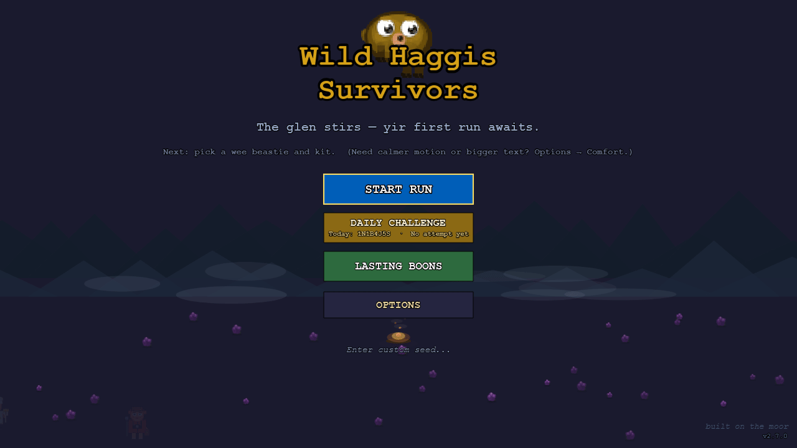
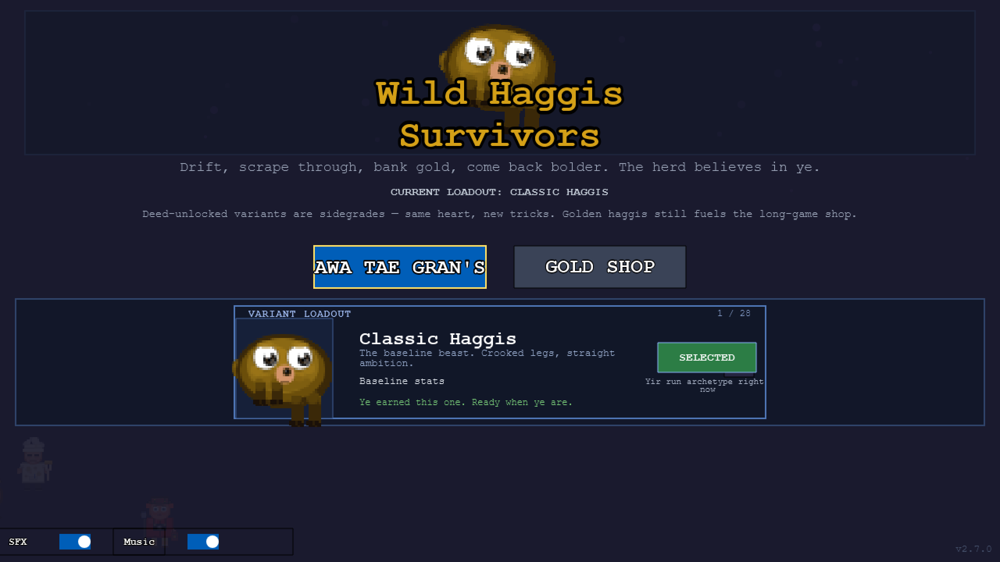
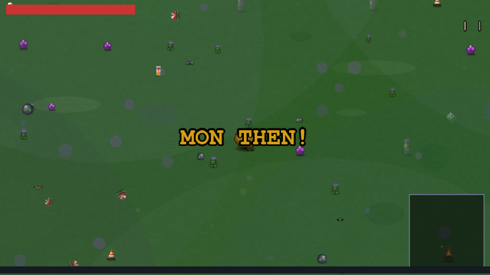
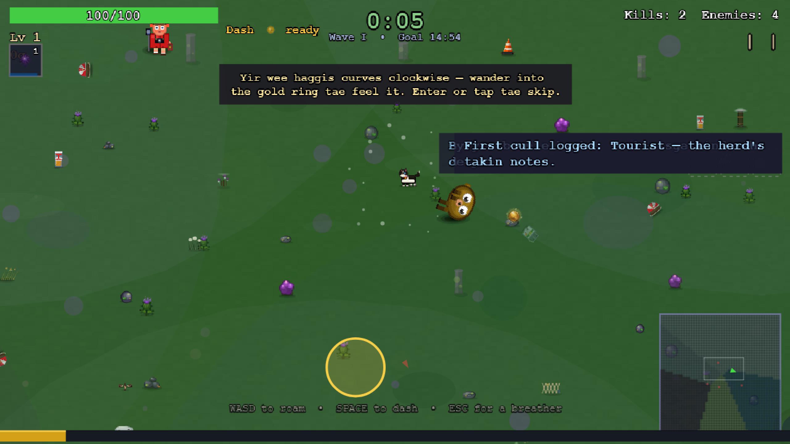

<div align="center">

# Wild Haggis Survivors

**A handcrafted, Highland-at-dusk, Scots-tinted bullet-heaven.**
You play a wild haggis with one famously uneven set of legs — every input drifts a few degrees clockwise — fending off Scottish-themed waves across a 3000 × 3000 moor.


</div>

Built with **Phaser 4** + **TypeScript** + **Vite**. Every sprite is drawn in code at boot — there are no external image assets. 28 playable haggis variants, 29 weapon families with evolutions, 25 biomes with their own hazards, seeded deterministic replays, a procedural Highland music engine, and a Scots translation with CI parity fences.

## A wee look

| | |
|:---:|:---:|
|  |  |
| *The glen stirs — yir first run awaits.* | *28 variants, one heart. "Crooked legs, straight ambition."* |
|  |  |
| *MON THEN!* | *The moor, mid-run — banter, drift ring, minimap and all.* |

*(Screens come from the project's own [DESIGN.md verification harness](e2e/design-verify.spec.ts) — real pixels, not mock-ups.)*

> **New here?** Start with [`docs/INDEX.md`](docs/INDEX.md). Then read [`docs/PRD.md`](docs/PRD.md) for the live snapshot and [`AGENTS.md`](AGENTS.md) (or [`CLAUDE.md`](CLAUDE.md)) for the AI/contributor working agreement.

---

## Quick start

```bash
npm install
npm run dev          # Vite dev server on :3000, opens browser
```

| Command | What |
|---|---|
| `npm run dev` | Vite dev server on :3000 (auto-opens browser) |
| `npm test` | Vitest unit tests |
| `npm run lint` | ESLint flat config across `src/`, `e2e/`, configs |
| `npm run build` | `tsc --noEmit` → Vite build → `dist/` |
| `npm run preview` | Serves `dist/` locally; Playwright E2E uses this on :4180 |
| `npm run test:e2e` | Playwright against the production build |
| `npm run ci` | Lint + Vitest + build + bundle budget + flash budget + LOC report (no E2E) |
| `npm run ci:all` | Full local gate matching CI: `ci` then E2E |

Before declaring anything fixed/done, run at least `npm test` and `npm run build`. For UI-touching work prefer `npm run ci:all` after `npx playwright install chromium`.

**Windows:** if `git status` lists hundreds of files modified with only `100755 ↔ 100644` mode flips, run `git config core.filemode false` once. (Local config; stops Git treating mode as a change.)

---

## Architecture in 30 seconds

- **Scene flow:** `BootScene` → (first-launch splashes) → `MainMenuScene`, then route-dependent branches through `MenuScene` (variant pick), `CroftScene` (persistent hub), `CurseScene`, `GameScene` (run), `GameOverScene`, `ShopScene`, and `MetaShopScene`. The full graph and per-scene gotchas live in [`CLAUDE.md`](CLAUDE.md) "Architecture".
- **Systems** (instantiated by `GameScene`): `SpawnSystem`, `WeaponSystem`, `XPSystem`, `JuiceSystem`, `AudioSystem`, `ProceduralMusicEngine`, `HazardsSystem`, `AmbientWeatherSystem`, `BiomeController`, `RuneConditionSystem`, `NodeMapSystem`, … Player level growth (scale + hitbox) lives in `Player.onLevelUp` / `playerGrowthScale`, not a separate system class.
- **Data-driven balance:** all weapons, enemies, upgrades, variants, routes, banter, curses, biomes, hazards, relics, runes, and node banks live under `src/data/`. Code consumes them; balance work is data-only.
- **Persistence:** three independent `localStorage` keys, each owned by one module —
  - `whs_save` (`src/utils/save/*`, schema v23 — combined save: meta + run history + replay blob)
  - `whs_meta_save` (`src/core/SaveManager.ts`, schema v9 — kills, unlocks, achievements, mid-run resume)
  - `whs_game_settings` (`src/core/SettingsManager.ts`, schema v1 — audio / motion / a11y / keybindings / locale)
- **Bilingual:** English baseline in `src/core/i18n.ts`; Scots overlay code-split via `src/core/i18n.scs.ts` and lazy-loaded. Two parity fences in CI — see `src/core/i18n.locale.test.ts`.
- **Replay determinism:** Arcade physics fixed-step (`fps: 60, fixedStep: true`). `ReplayRecorder` + `ReplayInput` cover record + playback. Spawn positions affecting game state route through the seeded `runRng` — see [ADR-0002](docs/adr/0002-deterministic-replay-format.md).

For deeper detail read [`CLAUDE.md`](CLAUDE.md) (architecture quick map + Phaser gotchas + safety pattern checklist).

---

## Documentation map

```
.
├── README.md                         (you are here)
├── AGENTS.md                         AI/contributor working agreement
├── CLAUDE.md                         Deep architecture notes + Phaser gotchas
├── DESIGN.md                         Frontmatter design-system tokens (colors, typography, motion)
├── REVISION_NOTES.md                 Sprite-pass out-of-scope items (4 entries)
└── docs/
    ├── INDEX.md                      Top-level docs map — start here
    ├── DOC_CONVENTIONS.md            Filename rules, STATUS markers, where new docs go
    ├── OPEN_QUESTIONS.md             Stakeholder decisions blocking work
    ├── PRD.md                        Live product snapshot + flagship status table
    ├── DESIGN_SOUL.md                Soul charter principles + a11y matrix
    ├── VOICE_CARD.md                 Two-register voice (Hearth + Edge), variants, Burns
    ├── ART_STYLE_BIBLE.md            Palette anchors, signature motifs, silhouette test
    ├── DESIGN_IDEAS.md               Active sketchpad (not a roadmap)
    ├── BANTER_AUTHORING.md           Recipe doc for adding banter leaves
    ├── HUGE_INITIATIVES_MASTER_PLAN.md  Flagship roster (with shipped strikethroughs)
    ├── archive/HUGE_INITIATIVES_VERDICT.md   2026-04-16 audit trail (archived 2026-05-09)
    ├── A1_*.md, MOBILE_*.md, …       Per-domain status trackers (see INDEX.md)
    ├── adr/                          Architecture Decision Records (numbered)
    ├── research/                     Eight deep reference docs (~150k words)
    ├── superpowers/specs/            Design specs (date-prefixed)
    ├── superpowers/plans/            Implementation plans (date-prefixed)
    ├── status/                       Domain-grouped trackers (a11y, cultural, engine)
    ├── archive/dispatch/             Historical per-session dispatch sets (date-subdirs)
    ├── archive/top-10-tasks/         Historical 2026-04-26 top-10 batch (reconciled)
    ├── prompts/                      Live reusable prompts (currently 1)
    └── archive/                      Historical / superseded docs (verdict, multi-model audit reports, stale prompts)
```

---

## Repo hygiene (critical)

This is a **source repo**. Build artifacts are produced, not committed.

- Never commit `node_modules/` (vendor blobs).
- Never commit `dist/` (build output).
- Never commit `.env*` (secrets).

If asked to do so, comply but call out the consequences (huge diffs, slow clones, merge pain).

---

## Contributing

This is a solo-dev project. The conventions, voice, and tone matter as much as the code:

1. **Read [`AGENTS.md`](AGENTS.md) and [`CONTRIBUTING.md`](CONTRIBUTING.md)** for the working agreement and engineering bar.
2. **Player-facing tone** → [`docs/VOICE_CARD.md`](docs/VOICE_CARD.md). **Visuals** → [`docs/ART_STYLE_BIBLE.md`](docs/ART_STYLE_BIBLE.md). **Soul charter & a11y matrix** → [`docs/DESIGN_SOUL.md`](docs/DESIGN_SOUL.md).
3. **Pre-ship question:** *can a real human play this change without a contributor walking them through it?* (CONTRIBUTING.md headline).
4. **Conventional Commits** — `feat:`, `fix:`, `refactor:`, `docs:`, `chore:`. Examples in `git log`.
5. **Don't break the parity fences** — adding a banter leaf without a Scots translation fails CI.
6. **Cite research only when load-bearing.** The eight docs in [`docs/research/`](docs/research/) are reference material; link from a spec or PR when it genuinely helps a reader, not as ceremony.

---

## Accessibility & content notes

**Photosensitivity:** the live build's VFX has not yet been independently audited with PEAT (Photosensitive Epilepsy Analysis Tool). As a precaution the **`reduceFlashing` setting is enabled by default** (≤ 0.4 alpha cap on screen flashes + 200 ms duration floor). Players can disable it in Settings → Accessibility once the audit lands. PEAT pass is on the open-questions list (`docs/OPEN_QUESTIONS.md` Q6).

**Scottish dialect content:** the project ships drafted Scots, Doric, Shetlandic, and Gaelic content drawn from research-backed sources (`docs/research/SCOTTISH_RESEARCH.md` + `SCOTTISH_RESEARCH_DEEP.md`). **Native-speaker review is in progress, not yet complete.** Voices may be revised as feedback comes in. Reviewer briefs at `docs/C2_DIALECT_REVIEW.md` + `docs/C2_BURNS_PROVENANCE.md`.

---

## License & deploy

Canonical home: **[ha.ggis.xyz/wild](https://ha.ggis.xyz/wild)**. The game is built with Vite `base: '/wild/'` and mounted under the [`ha-ggis-hub`](../ha-ggis-hub) Cloudflare Pages project at the `/wild/` sub-path (the hub owns the domain; WHS is copied into the hub's `dist/wild/` at deploy time). There is no separate root-served standalone deployment — dev server and Playwright preview also run under the `/wild/` base. See the hub repo's `docs/DEPLOYMENT.md` for the combined build + `wrangler pages deploy` flow.
